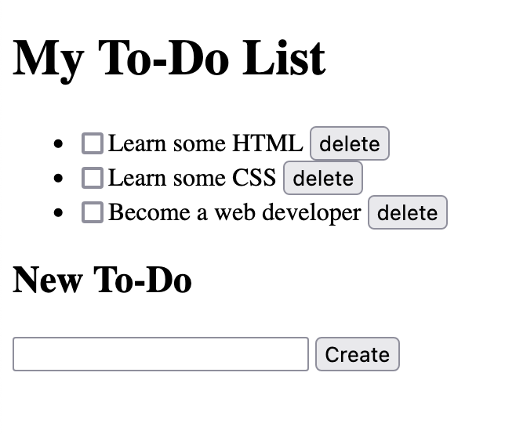

# HTML

HTML is the basic building block of all web development. It's not too complex, but it's important to be able to understand how to build well-structured pages that are easier for developers to work with. We won't be styling the page yet - that will come next.

## Task

Build a mock-up of a to-do list web page. It should feature:

- [ ] A title element for your to-do list [`html title element`]
- [ ] Some existing to-do items
- [ ] A button for each to-do item to delete it (it won't do anything just yet) [`html button element`]
- [ ] A form at the bottom of the page to add a new to-do item (an text entry box and a button - also won't do anything yet) [`html forms`]

And that's it for now (we'll build on this in future stages)

You can start with the `index.html` page in this folder.

## Learning points

Use these points to question what you've done and to guide you to some learnings around what the right way of doing things might be:

- [ ] Make sure you understand the difference between what goes in `<head>` and what goes in `<body>`. [`html head and body`]
- [ ] Your to-do items are a list, are you using a list to store them? Understand the different types of list. [`html lists`]
- [ ] Make sure you give your to-do item a checkbox so you can complete it. [`html input checkbox`]
- [ ] Which element are you using for the delete button? Is a `<button>` the right thing here or just an `<a>` link? Think about the `semantics` of a button vs. a link. [`html button vs link`]
- [ ] Are you using a `<form>` element to contain the form at the bottom of the page?
- [ ] Are you also using a `<button>` element for the "new to-do" element, or is there another way? [`html submit form`]
- [ ] Have you created valid HTML? Check it using an [HTML validator](https://validator.w3.org/)
- [ ] Are there parts of your page that belong together? Consider using semantic elements to group them together and make your styling easier. [`html semantic elements`]

If you've done all of this then you should end up with something spectacular like this:

