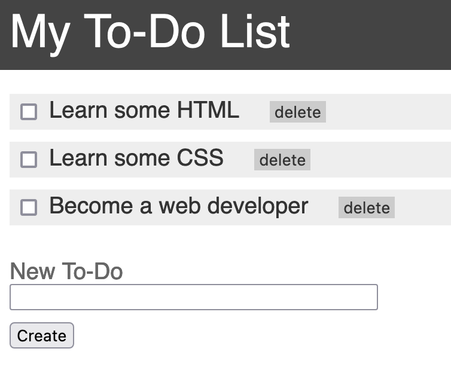

# CSS

If the HTML in step 1 provides the content of a web page, CSS provides the style. One of the phrases that was used early in the life of CSS was "separating style from content" and this still applies as a good practice. Your HTML should ideally still make sense with no style applied, and the CSS should make it look good.

## Task

Copy the html file from the previous step into this folder. You should add style to it so that it looks better. You should:

- [ ] Start with an inline stylesheet in the head of your existing page
- [ ] Give each to-do item a clearer boundary around it
- [ ] Make the "delete" button less obtrusive
- [ ] Use a different font for the page (let's go with a sans-serif one to make it look modern)
- [ ] Use the title in a header element for the page (you might need to add this)
- [ ] Move your stylesheet into an external file and link it into the document

It's still not going to be a functional to-do list, but it should look a little better than the previous step.

## Learning points

Use these points to question what you've done and to guide you to some learnings around what the right way of doing things might be:

- [ ] Try to set subtly different colours on the background for the odd and even rows of to-do items. First, try using classes for this, then see if you can do it without altering the HTML at all. [`css alternating row color`]
- [ ] How have you organised your CSS? Does it make a logical sense? Sometimes it's useful to set id's or classes on elements so you can be clear about what they're for
- [ ] If you've set any id's or classes, do they describe what the element actually is?
- [ ] Have you used any id's or classes more than once? [`css when to use ids and classes`]
- [ ] Are you taking advantage of CSS selectors to make sure you're using fewer rules? [`css apply rules to multiple elements`]
- [ ] Try styling the delete buttons so they change colour when you hover and click them. [`css a pseudo classes`]
- [ ] Have you run into default style on elements that wasn't helpful? Consider using a simple css reset stylesheet. Should you add it into your existing CSS stylesheet or as a new stylesheet for the page? [`default css styles`, `css reset`]
- [ ] Make sure you understand how to apply individual rules and how to apply them in shorthand (e.g. margin, background) [`css shorthand`]
- [ ] Make use you understand how to use margins and padding to create space around elements. This is the CSS Box Model which you should understand. [`css box model`]

If you've done all of this then you should end up with something like this:

